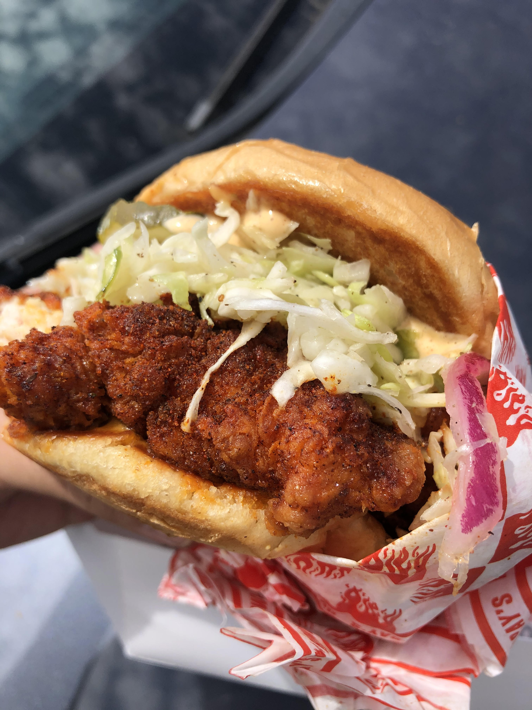

# Eric Pham

## Hello! My name is Eric, and this is my GitHub page for my CSE 110 assignment.

## Section Links

[About Me](#about-me)

[Completing the Assignment](#completing-the-assignment)

[Code](#code)

[Lists](#lists)

[TODO](#todo)

### About Me


This is a rather large picture of myself. I don't update it very often, but you can find more pictures of me [on my Instagram](https://www.instagram.com/the_eric_pham/).


### Completing the Assignment

The requirements for this assignment specify _"Pictures"_ in plural, so I guess I'll add another one.



That's a good looking chicken sandwich. It was from **Howling Ray's in L.A**. I highly recommend, probably the best chicken sandwich I've ever had.

> "...Probably the best chicken sandwich I've ever had"
> 
> \- Me

### Code

I'm currently pursuing a B.S. in computer science at UCSD, so naturally, I code.

Here's a block of code for the extremely slow way to get the nth number from the Fibonnaci sequence.

```javascript
const fib = (n) => {
    if (n === 1)
        return 1;
    if (n === 2)
        return 1;
    return fib(n-1) + fib(n-2);
}
```

What a ~~great~~ demonstration of my skills.

_Psst... if you want a surprise click on_ [this link](./randomtext.txt)


### Lists
- Lists were invented about 200 years ago
- That point above is definitely not true

Here are some reasons why lists are so great
1. They keep things organized
   - Not only can they list ideas, they can list sub-ideas
     - Even sub-ideas of those sub-ideas
   - Lists have structure
2. People are very familiar with lists
3. They allow you to complete the assignment
4. Need I say more?

### TODO

- [x] Finish this page
- [ ] Get a job
- [x] Eat lunch
